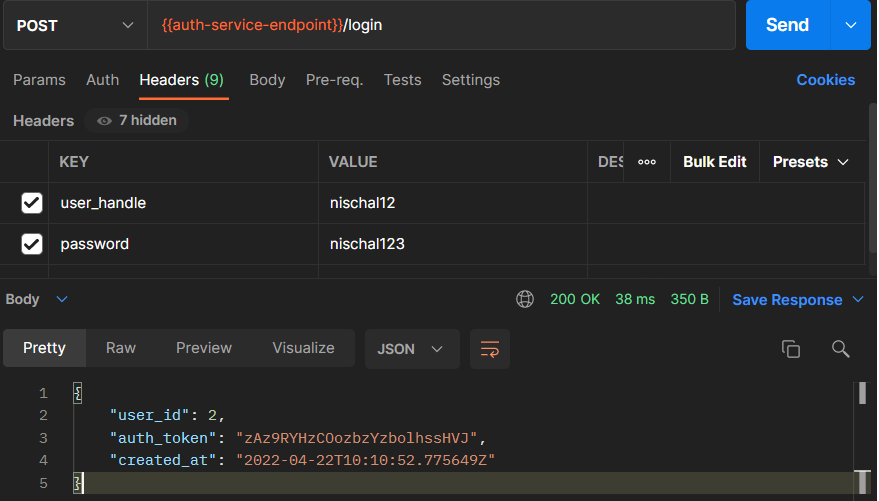
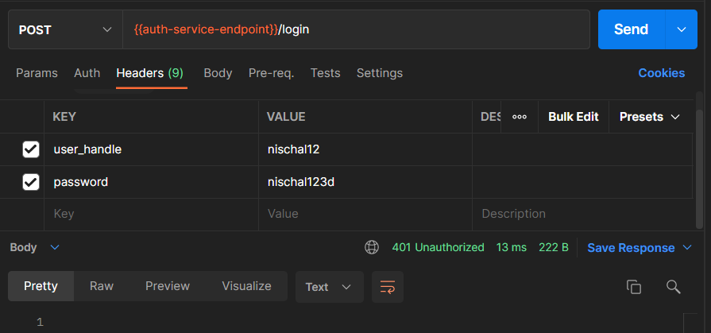
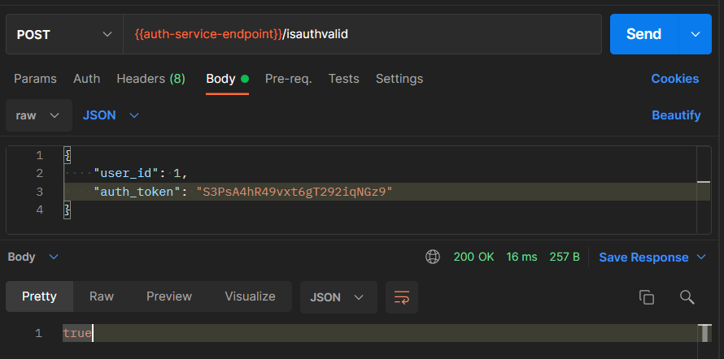
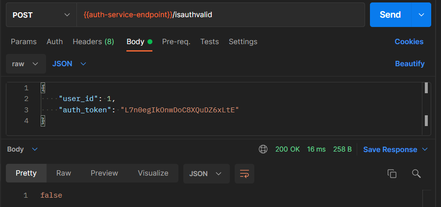
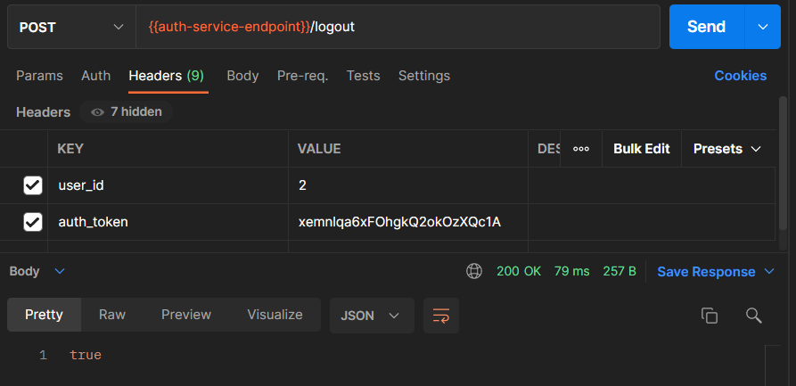
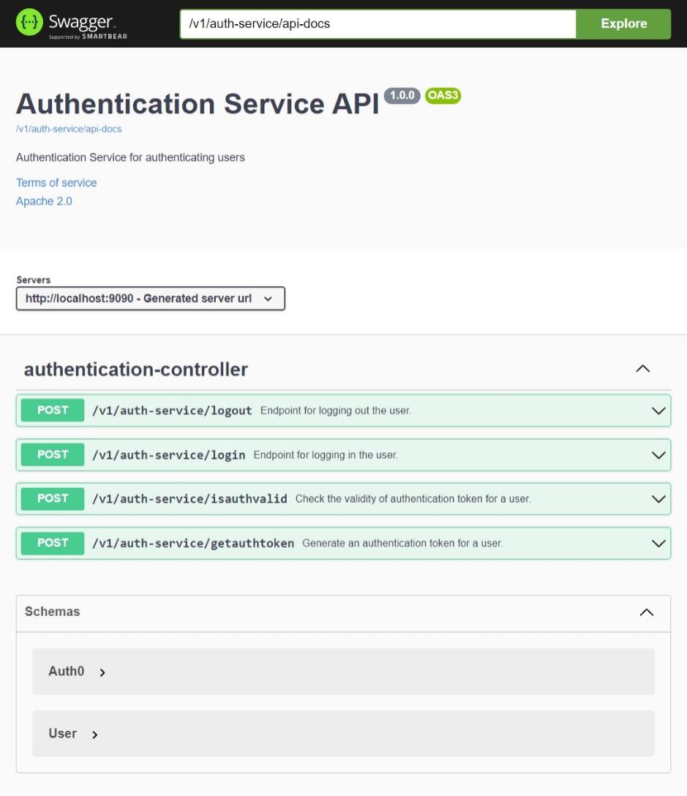

# Authentication service

This service takes care of authentication related workloads. In general, the endpoints in this service accepts JSON payloads containing the `user_id`, `user_handle` and `password` fields of a user. The service validates these values against the database and generates a token which is a string containing 25 random alpha-numeric characters.

- The auth token generation logic is present in `setAuth_token()` method in `com.ut.authentication.models.Auth0`.
- Every authentication token is valid for 30 min from creation time.
- Any token is invalid in the following scenarios:
  - Older than 30 min
  - User doesn't have a token in the database
  - User's token in the DB does't match the provided token

This service is connected to by all other service as at least one endpoint method in the other services require authentication. All communications with this service are synchronous.

## Data models

All methods make use of either or both of these object models:

| Model | Class                                | Database    |
| ----- | ------------------------------------ | ----------- |
| User  | `com.ut.authentication.models.User`  | `user`      |
| Auth0 | `com.ut.authentication.models.Auth0` | `authtoken` |

## Endpoints

This service is hosted at `/v1/auth-service` with the following available endpoints:

1. **POST** on `/login`: This endpoint takes in the `user_handle` and `password`, validates them and generates a new token to use for the user.

   - Requires the following header attributes:

     | key           | param       |
     | ------------- | ----------- |
     | _user_handle_ | username123 |
     | _password_    | password123 |

   - Returns a JSON payload as follows (`Auth0` model):

   ```
   {
   	"user_id": 2,
   	"auth_token": "3jeuNE8w73nsdKIdwoamd98JN",
   	"created_at": "2022-04-08T21:59:38.306Z"
   }
   ```

Logging in with valid credentials:


Logging in with invalid credentials:


2. **POST** on `/getauthtoken`: This endpoint is required to re-authenticate a user after their existing authentication token expires. This endpoint takes in the `user_handle` and `auth_token`, validates them and generates a new token to use for the user, if provided token is expired.

   - Requires the following header attributes:

     | key           | param                     |
     | ------------- | ------------------------- |
     | _user_handle_ | username123               |
     | _auth_token_  | 3jeuNE8w73nsdKIdwoamd98JN |

   - Returns a JSON payload as follows (`Auth0` model):

   ```
   {
   	"user_id": 2,
   	"auth_token": "wkejf7832fbiw3f7hfwo93fbj",
   	"created_at": "2022-04-08T21:59:38.306Z"
   }
   ```

3. **POST** on `/isauthvalid`: This endpoint returns `true` or `false` based on if the provided `auth_token` is still valid - either based on time or correspondence between `user_id` and the `auth_token`.

   - Requires the following header attributes:

   | key           | param                     |
   | ------------- | ------------------------- |
   | _user_handle_ | username123               |
   | _auth_token_  | 3jeuNE8w73nsdKIdwoamd98JN |

   - Returns either `true` or `false` boolean payload.

Checking valid authentication credentials:


Checking invalid authentication credentials:


4. **POST** on `/logout`: This endpoint, as the name suggests, logs the user out of the application. As a dummy implementation for the project, the user's `auth_token` is removed from the database, making it invalid for any authentication related tasks. The current token is first validated to avoid unwanted logouts.

   - Requires the following header attributes:

     | key           | param                     |
     | ------------- | ------------------------- |
     | _user_handle_ | username123               |
     | _auth_token_  | 3jeuNE8w73nsdKIdwoamd98JN |

   - Returns either `true` or `false` boolean payload.

Logging out:

## Swagger UI


