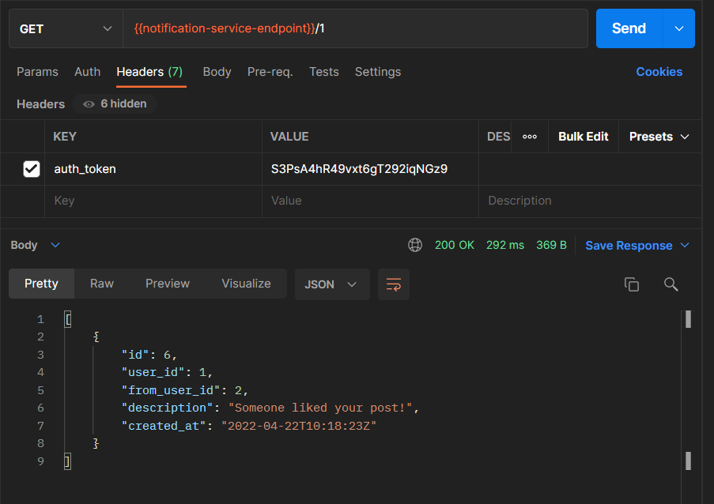
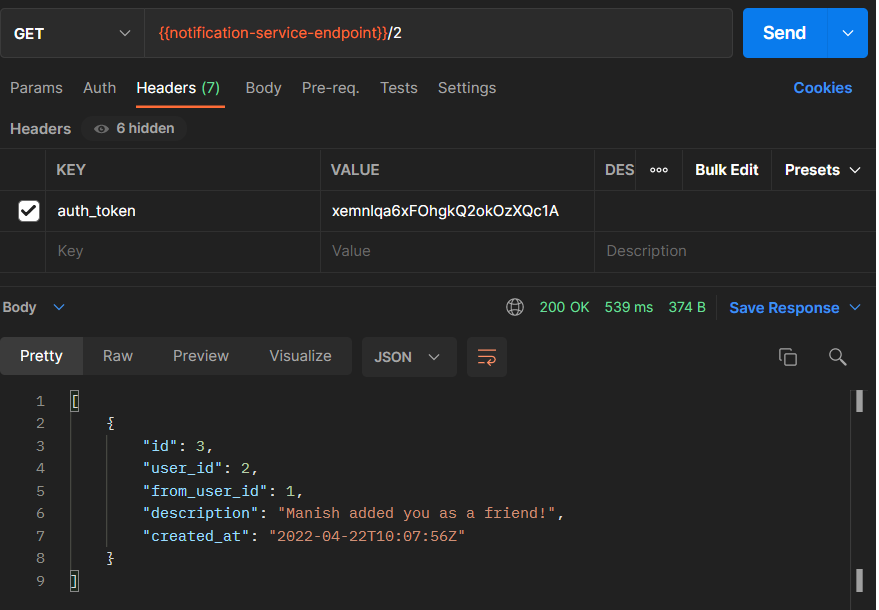
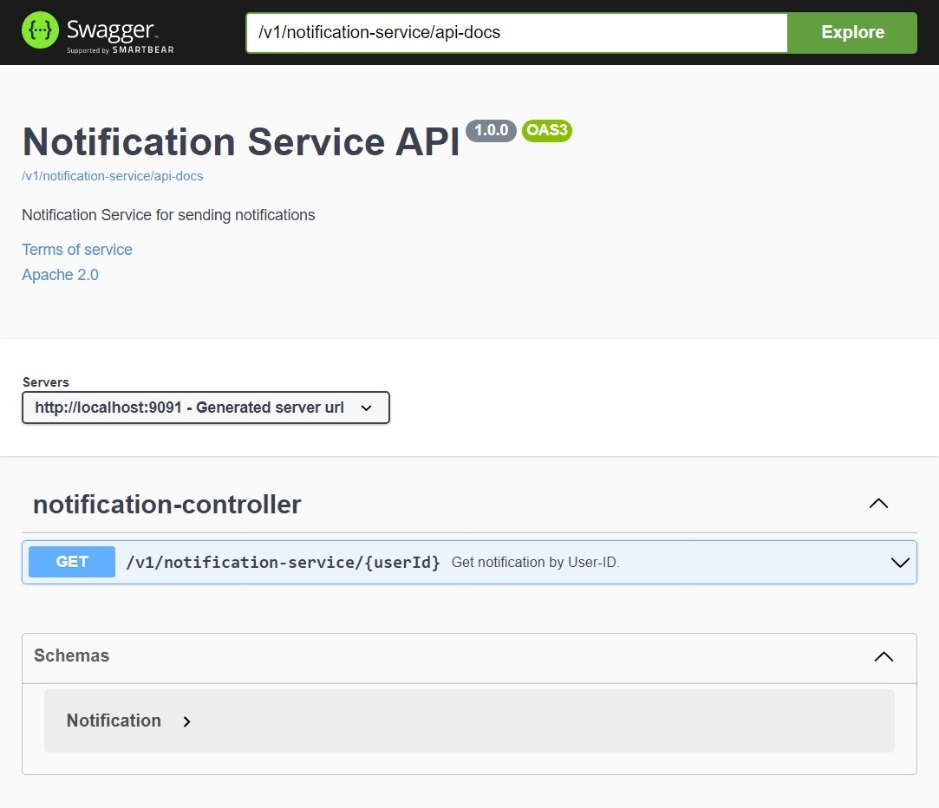

# Notification Service

This is an asynchronous service, that is subscribed to a *message queue* representing notifications pushed by other services. It saves the notification sent to the user and handles reading a logged-in user's notifications. As accessing a user's notification should have authentication based access, this service communicates synchronously to the **Authentication service**.

This service is used by the User service and Post service to send notifications asynchronously on adding another user as friend or liking a post.

## Data models

The endpoints in this service make use of the following data models:

| Model        | Class                                            | Database        |
| ------------ | ------------------------------------------------ | --------------- |
| Notification | `com.ut.notificationservice.models.Notification` | `notifications` |
| Auth0        | `com.ut.notificationservice.models.Auth0Body`    | `users`         |

_**Note**: The `Auth0Body` model connects to the `users` table in the database to fetch user details to add to notifications. It is used for synchronous communication with the authentication service._

## Endpoints

This service is hosted on `/v1/notification-service`

The following endpoints are available, all of them require user authentication:

1. **GET** on `/{userId}`: This endpoint returns an array of all notifications of the user.

   - Requires the following header attributes:

     | key          | param                     |
     | ------------ | ------------------------- |
     | _user_id_    | 2                         |
     | _auth_token_ | 3jeuNE8w73nsdKIdwoamd98JN |

   - Returns a JSON payload as follows (Array of `Notification` model):

     ```
     	[
     		{
     			"id": 5,
     			"user_id": 2,
     			"from_user_id": 5,
     			"description": "User2 liked your post!",
     			"created_at": "2022-04-08T22:23:29.779Z"
     		},
     		...
     	]
     ```

Notification on liking a post:


Notification on being added as a friend:

## Swagger UI


