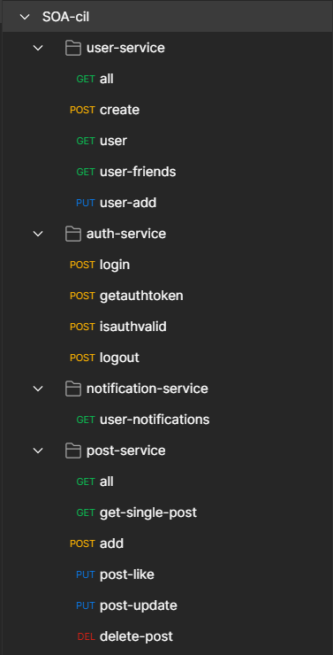

# SOA-cil

A social network application using SOA concepts, made as a project for the SOA course at the University of Twente - 2022.

This project aims at creating a social networking website using microservices. The project uses the following tools:

- Backend code written in **Java 11** using _Spring-boot_
- **MySQL** database for persistance storage
- **RabbitMQ** for asynchronous message queue
- **Swagger-UI** for documentation
- **Kubernetes** for deployment

The project uses REST services and works specifically using JSON payloads.

## Running locally

Running locally, the following changes must be done:

- Update `application.properties` for each of the service for the correct mysql host and rabbitmq host (for services using message queues - `user` service, `notif` service, and `post` service).
- Run the docker commands present in [docker-commands](docker-commands) file.

After this, the services can be run as spring boot applciations from the IDE without having to install MYSQL and RabbitMQ server locally.

## Available Services

There are currently 4 backend services in the project, each one of them in their own folders. These services together make the application work.

- Authentication service
- Notification service
- Post service
- User service

More details on each service is present in the README in the services' respective folders, along with endpoint descriptions and swagger screenshots.

## Data models and database connection

The following data models are used:

1. Auth0:
   ```
   {
   	"user_id" : 1,
   	"auth_token": "3jeuNE8w73nsdKIdwoamd98JN",
   	"created_at": "2022-04-08T21:59:38.306Z"
   }
   ```
2. Notification:
   ```
   {
   	"id": 4,
   	"user_id": 2,
   	"from_user_id":3,
   	"description":"This is notification 4 from user 3 to user 2",
   	"created_at":"2022-04-08T21:59:38.306Z"
   }
   ```
3. Post:
   ```
   {
   	"post_id": 4,
   	"content": "This is post 4 from user 2, with 5 likes 😁",
   	"user_id": 2,
   	"likes": 5,
   	"created_at": "2022-04-08T22:54:12.211Z"
   }
   ```
4. User:
   ```
   {
   	"user_id": 2,
   	"user_handle": "username",
   	"firstName": "Name",
   	"lastName": "LastName",
   	"password": "password123",
   	"bio": "Just another user on SOAcil 😭",
   	"friends": [3, 7],
   	"joined": "2022-04-08T23:05:06.005Z"
   }
   ```

We have used [MySQL](https://www.mysql.com/) database for persistant storage. The tables are automatically created using JPA and hibernate on the database with name `soadb`. The following tables are used from the database:

| Table name      | Model representation               |
| --------------- | ---------------------------------- |
| `authtoken`     | `Auth0`                            |
| `notifications` | `Notification`                     |
| `posts`         | `Post`                             |
| `users`         | `User`                             |
| `user_friends`  | _Stores array of `user`'s friends_ |

## Testing

The endpoints are manually tested using [Postman](https://www.postman.com/) and no junits are written for the service, due to the nature of the course and project.

### Postman Collection

The `SOA-cil.postman_collection.json` file can be imported into postman to test the API REST endpoints.



## Application build

The scripts [build-push-img.ps1](build-push-img.ps1) for Windows (requires powershell installed) and [build-push-img.sh](build-push-img.ps1) for Linux contains simple gradle build steps to build the jar, build the docker image and push the image to docker hub.

It goes through each of the service folders and runs the following steps:

```
./gradlew bootJar
docker build . -t zedd08/soacil-{service-name}
docker push zedd08/soacil-{service-name}
```

### Gradle build

The service build is handled by the `gradlew` wrapper.

### Docker image creation

From the previous build step, the generated jar which is present in the `build/lib` directory of the service is copied to the docker image and an entry point is set which runs the image with the command. The Dockerfiles for every service is the same, except for the jar file name, contents as:

```
FROM adoptopenjdk:11-jre-hotspot

WORKDIR /app
COPY build/libs/{service-jar-name}.jar service.jar

ENV PORT 909x
EXPOSE 909x

ENTRYPOINT ["java","-jar","service.jar"]
```

The created image is then pushed to docker hub so that kubernetes can download it for deployment.

Each of the service is built into a separate docker image and pushed to [docker hub under zedd08 namespace](https://hub.docker.com/u/zedd08).

The folder [kube](kube) contains all the required deployment YAMLs and their description in the README.

## Deployed Kubernetes architecture overview
